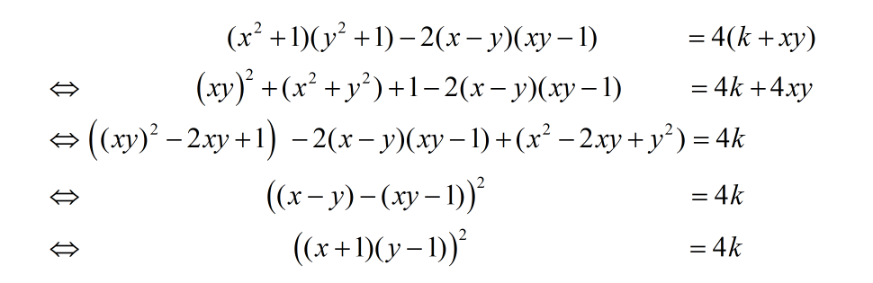
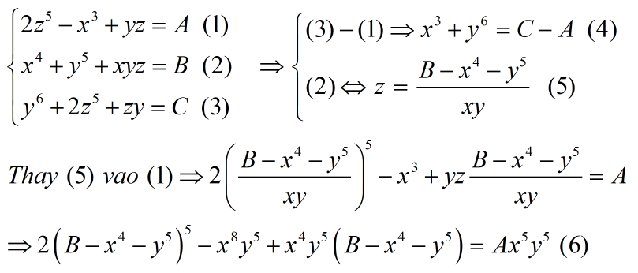
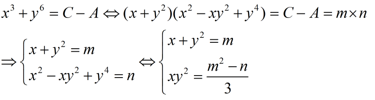
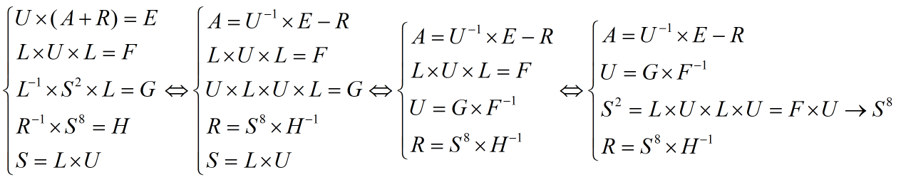

# Challenge

## Farm 

Đề cho ta 1 đoạn script

```python
#!/usr/bin/env sage

from sage.all import *
import string, base64, math
from flag import flag

ALPHABET = string.printable[:62] + '\\='

F = list(GF(64))

def keygen(l):
    key = [F[randint(1, 63)] for _ in range(l)] 
    key = math.prod(key) # Optimization the key length :D
    return key

def maptofarm(c):
    assert c in ALPHABET
    return F[ALPHABET.index(c)]

def encrypt(msg, key):
    m64 = base64.b64encode(msg)
    enc, pkey = '', key**5 + key**3 + key**2 + 1
    for m in m64:
        enc += ALPHABET[F.index(pkey * maptofarm(chr(m)))]
    return enc

# KEEP IT SECRET 
key = keygen(14) # I think 64**14 > 2**64 is not brute-forcible :P

enc = encrypt(flag, key)
print(f'enc = {enc}')
```

Đọc sơ qua thì ta thấy các hàm **encrypt** và **maptofarm** có thể **reverse** được, mấu chốt nằm ở việc **flag** được encrypt với cái **key** được sinh từ tích **14** số ngẫu nhiên trong **GF(64)**, vậy muốn tìm **key** thì ta phải bruteforce **64^14** trường hợp ư???

Hehe, không hẳn như vậy. Chúng ta chú ý các phép toán được tính trên **GF(64)**, nên dẫu có tích vài chục vài trăm hay vài tỷ số thì kết quả cũng nằm trong **GF(64)** thuii, vậy ta chỉ cần brute 64 trường hợp là đủ!

```python
from sage.all import *
from string import printable
from base64 import b64decode

ALPHABET = printable[:62] + '\\='

def rev(c):
   return ALPHABET[F.index(c)]

def decrypt(enc, key):
   flag, pkey = '', key**5 + key**3 + key**2 + 1
   for c in enc:
      flag += rev(F[ALPHABET.index(c)]/pkey)
   return b64decode(flag)

F = list(GF(64))
enc = "805c9GMYuD5RefTmabUNfS9N9YrkwbAbdZE0df91uCEytcoy9FDSbZ8Ay8jj"

for key in F:
   try:
      flag = decrypt(enc, key)
      if b'CCTF{' in flag:
         print(f'[+] Flag: {flag.decode()}')
         break
   except:
      pass

# [+] Flag: CCTF{EnCrYp7I0n_4nD_5u8STitUtIn9_iN_Fi3Ld!}
```

**Flag: CCTF{EnCrYp7I0n_4nD_5u8STitUtIn9_iN_Fi3Ld!}**


## Tuti

```py
#!/usr/bin/env python3

from Crypto.Util.number import *
from flag import flag

l = len(flag)
m_1, m_2 = flag[: l // 2], flag[l // 2:]

x, y = bytes_to_long(m_1), bytes_to_long(m_2)

k = '''
000bfdc32162934ad6a054b4b3db8578674e27a165113f8ed018cbe9112
4fbd63144ab6923d107eee2bc0712fcbdb50d96fdf04dd1ba1b69cb1efe
71af7ca08ddc7cc2d3dfb9080ae56861d952e8d5ec0ba0d3dfdf2d12764
'''.replace('\n', '')

assert((x**2 + 1)*(y**2 + 1) - 2*(x - y)*(x*y - 1) == 4*(int(k, 16) + x*y))
```

Đọc qua đề thì đầu tiên **flag** bị tách làm đôi, thành 2 phần là **x** và **y**. Tiếp theo đề cho ta số **k** và một hệ thức giữa **x, y, k**. Hmmm thử biến đổi tí xem sao



Như vậy ta hoàn toàn xác định được tích **(x + 1)\*(y - 1)** (giả sử là **P**). Vậy để tìm **x, y** ta chỉ việc duyệt qua các ước của **P** và thử xem cái **x** nào bắt đầu là **CCTF{** là được =))

```python
from Crypto.Util.number import bytes_to_long

k = '''
000bfdc32162934ad6a054b4b3db8578674e27a165113f8ed018cbe9112
4fbd63144ab6923d107eee2bc0712fcbdb50d96fdf04dd1ba1b69cb1efe
71af7ca08ddc7cc2d3dfb9080ae56861d952e8d5ec0ba0d3dfdf2d12764
'''.replace('\n', '')

P = sqrt(4 * int(k, 16))
divs = P.divisors()

for d in divs:
   x = int(d - 1)
   y = int(P//d + 1)
   flag = long_to_bytes(x) + long_to_bytes(y)
   if b'CCTF{' in flag:
      print(f'[+] Flag: {flag.decode()}')
      break

# [+] Flag: CCTF{S1mPL3_4Nd_N!cE_Diophantine_EqUa7I0nS!}
```

**Flag: CCTF{S1mPL3_4Nd_N!cE_Diophantine_EqUa7I0nS!}**


## RSAphantine

```python
2*z**5 - x**3 + y*z = 47769864706750161581152919266942014884728504309791272300873440765010405681123224050402253883248571746202060439521835359010439155922618613520747411963822349374260144229698759495359592287331083229572369186844312169397998958687629858407857496154424105344376591742814310010312178029414792153520127354594349356721
x**4 + y**5 + x*y*z = 89701863794494741579279495149280970802005356650985500935516314994149482802770873012891936617235883383779949043375656934782512958529863426837860653654512392603575042842591799236152988759047643602681210429449595866940656449163014827637584123867198437888098961323599436457342203222948370386342070941174587735051
y**6 + 2*z**5 + z*y = 47769864706750161581152919266942014884728504309791272300873440765010405681123224050402253883248571746202060439521835359010439155922618613609786612391835856376321085593999733543104760294208916442207908167085574197779179315081994735796390000652436258333943257231020011932605906567086908226693333446521506911058
p = nextPrime(x**2 + z**2 + y**2 << 76)
q = nextPrime(z**2 + y**3 - y*x*z ^ 67)
n, e = p * q, 31337
m = bytes_to_long(FLAG)
c = pow(m, e, n)
c = 486675922771716096231737399040548486325658137529857293201278143425470143429646265649376948017991651364539656238516890519597468182912015548139675971112490154510727743335620826075143903361868438931223801236515950567326769413127995861265368340866053590373839051019268657129382281794222269715218496547178894867320406378387056032984394810093686367691759705672
```

Đề cho ta 1 hệ phương trình 3 biến **x, y, z** và sinh các số nguyên tố **p, q** từ các số **x, y, z**. Vậy muốn tìm **p, q** trước tiên ta phải giải hệ 3 biến này cái đã. Mình sẽ trình bày 2 hướng tiếp cận của mình...

Đầu tiên biến đổi xíu đã ~~



#### Hướng 1

Sau khi biến đổi ta thấy có 2 phương trình (4) và (6) chỉ còn 2 ẩn **x, y** vậy có thể dễ dàng tìm ra 1 trong 2 số bằng cách thiết lập 2 đa thức và tính [resultant](https://mathworld.wolfram.com/Resultant.html) của chúng, có 1 số rùi ta dễ dàng tính được các số còn lại.

```python
from gmpy2 import iroot
from Crypto.Util.number import *
from sage.all import *

A = 47769864706750161581152919266942014884728504309791272300873440765010405681123224050402253883248571746202060439521835359010439155922618613520747411963822349374260144229698759495359592287331083229572369186844312169397998958687629858407857496154424105344376591742814310010312178029414792153520127354594349356721
B = 89701863794494741579279495149280970802005356650985500935516314994149482802770873012891936617235883383779949043375656934782512958529863426837860653654512392603575042842591799236152988759047643602681210429449595866940656449163014827637584123867198437888098961323599436457342203222948370386342070941174587735051
C = 47769864706750161581152919266942014884728504309791272300873440765010405681123224050402253883248571746202060439521835359010439155922618613609786612391835856376321085593999733543104760294208916442207908167085574197779179315081994735796390000652436258333943257231020011932605906567086908226693333446521506911058

P.<x, y> = PolynomialRing(ZZ)
f = x^3 + y^6 + A - C
g = 2*(B - x^4 - y^5)^5 - x^8 * y^5 + x^4 * y^5 * (B - x^4 - y^5) - A * x^5 * y^5 

res = f.resultant(g)
Y = res.univariate_polynomial().roots()[0][0]

X, check = iroot(abs(C - A - Y^6), 3)
X *= (-1)*((C - A - Y^6) < 0)
assert check

Z = (B - X^4 - Y^5)//(X*Y)

p = next_prime(X**2 + Z**2 + int(Y**2) << 76)
q = next_prime(Z**2 + Y**3 - Y*X*Z ^^ 67)
e = 31337
c = 486675922771716096231737399040548486325658137529857293201278143425470143429646265649376948017991651364539656238516890519597468182912015548139675971112490154510727743335620826075143903361868438931223801236515950567326769413127995861265368340866053590373839051019268657129382281794222269715218496547178894867320406378387056032984394810093686367691759705672

d = inverse_mod(e, (p - 1)*(q - 1))
flag = int(pow(c, d, p*q))

print(long_to_bytes(int(flag)))

# b'CCTF{y0Ur_jO8_C4l13D_Diophantine_An4LySI5!}'
```

#### Hướng 2

Ta thử biến đổi phương trình (4) một xí...



Ta thấy nếu ta phân tích được số **(C - A)** thì dễ dàng tính được **tổng và tích** hai số **x và y^2**, rùi giải phương trình bậc 2 thuiii

```python
from gmpy2 import iroot
from Crypto.Util.number import *
from sage.all import *

A = 47769864706750161581152919266942014884728504309791272300873440765010405681123224050402253883248571746202060439521835359010439155922618613520747411963822349374260144229698759495359592287331083229572369186844312169397998958687629858407857496154424105344376591742814310010312178029414792153520127354594349356721
B = 89701863794494741579279495149280970802005356650985500935516314994149482802770873012891936617235883383779949043375656934782512958529863426837860653654512392603575042842591799236152988759047643602681210429449595866940656449163014827637584123867198437888098961323599436457342203222948370386342070941174587735051
C = 47769864706750161581152919266942014884728504309791272300873440765010405681123224050402253883248571746202060439521835359010439155922618613609786612391835856376321085593999733543104760294208916442207908167085574197779179315081994735796390000652436258333943257231020011932605906567086908226693333446521506911058

divs = (C - A).divisors()
divs = divs + [-d for d in divs]

def sol(S, P):
   # x^2 - Sx + P = 0
   sqr, _ = iroot(S^2 - 4*P, 2)
   assert _
   x = (S + sqr)//2

   assert P%x == 0
   y = P//x
   if x > 0 and iroot(x, 2)[1]:
      return (y, iroot(x, 2)[0])
   if y > 0 and iroot(y, 2)[1]:
      return (x, iroot(y, 2)[0])
   assert 1 == 2

SOL = []
for m in divs:
   n = (C - A)//m
   if (m^2 - n)%3 == 0:
      S = m; P = (m^2 - n)//3
      if S^2 >= 4*P:
         try:
            SOL.append(sol(S, P))
         except:
            pass

e = 31337
c = 486675922771716096231737399040548486325658137529857293201278143425470143429646265649376948017991651364539656238516890519597468182912015548139675971112490154510727743335620826075143903361868438931223801236515950567326769413127995861265368340866053590373839051019268657129382281794222269715218496547178894867320406378387056032984394810093686367691759705672

for (X, Y) in SOL:
   Z = (B - X^4 - Y^5)//(X*Y)

   p = next_prime(X**2 + Z**2 + int(Y**2) << 76)
   q = next_prime(Z**2 + Y**3 - Y*X*Z ^^ 67)

   d = inverse_mod(e, (p - 1)*(q - 1))
   flag = long_to_bytes(int(pow(c, d, p*q)))
   if b'CCTF{' in flag:
      print(f'[+] Flag: {flag.decode()}')
      break

# [+] Flag: CCTF{y0Ur_jO8_C4l13D_Diophantine_An4LySI5!}
```

**Flag: CCTF{y0Ur_jO8_C4l13D_Diophantine_An4LySI5!}**


## Onlude

```python
#!/usr/bin/env sage

from sage.all import *
from flag import flag

global p, alphabet
p = 71
alphabet = '=0123456789abcdefghijklmnopqrstuvwxyzABCDEFGHIJKLMNOPQRSTUVWXYZ$!?_{}<>'

flag = flag.lstrip('CCTF{').rstrip('}')
assert len(flag) == 24

def cross(m):
    return alphabet.index(m)

def prepare(msg):
    A = zero_matrix(GF(p), 11, 11)
    for k in range(len(msg)):
        i, j = 5*k // 11, 5*k % 11
        A[i, j] = cross(msg[k])
    return A

def keygen():
    R = random_matrix(GF(p), 11, 11)
    while True:
        S = random_matrix(GF(p), 11, 11)
        if S.rank() == 11:
            _, L, U = S.LU()
            return R, L, U

def encrypt(A, key):
    R, L, U = key
    S = L * U
    X = A + R
    Y = S * X
    E = L.inverse() * Y
    return E

A = prepare(flag)
key = keygen()
R, L, U = key
S = L * U
E = encrypt(A, key)
print(f'E = \n{E}')
print(f'L * U * L = \n{L * U * L}')
print(f'L^(-1) * S^2 * L = \n{L.inverse() * S**2 * L}')
print(f'R^(-1) * S^8 = \n{R.inverse() * S**8}')
```

Bài này chúng ta cần làm việc với ma trận... Ở đây có liên quan tới khái niệm [LU decomposition](https://en.wikipedia.org/wiki/LU_decomposition), ta thử biến đổi xíu xem sao...



**E, F, G, H** là các giá trị đề bài cho. Theo như các bước biến đổi phía trên ta dễ dàng tính được **U, S^2, R** từ đó tính được **A** và tìm ra **flag**

```python
p = 71
alphabet = '=0123456789abcdefghijklmnopqrstuvwxyzABCDEFGHIJKLMNOPQRSTUVWXYZ$!?_{}<>'

def recross(c):
   return alphabet[c]

def decrypt(A):
   flag = ""
   for k in range(24):
      i, j = 5*k // 11, 5*k % 11
      flag += recross(A[i, j])
   return flag

E = [[25, 55, 61, 28, 11, 46, 19, 50, 37,  5, 21],
[20, 57, 39,  9, 25, 37, 63, 31, 70, 15, 47],
[56, 31,  1,  1, 50, 67, 38, 14, 42, 46, 14],
[42, 54, 38, 22, 19, 55,  7, 18, 45, 53, 39],
[55, 26, 42, 15, 48,  6, 24,  4, 17, 60, 64],
[ 1, 38, 50, 10, 19, 57, 26, 48,  6,  4, 14],
[13,  4, 38, 54, 23, 34, 54, 42, 15, 56, 29],
[26, 66,  8, 48,  6, 70, 44,  8, 67, 68, 65],
[56, 67, 49, 61, 18, 34, 53, 21,  7, 48, 32],
[15, 70, 10, 34,  1, 57, 70, 27, 12, 33, 46],
[25, 29, 20, 21, 30, 55, 63, 49, 11, 36,  7]]

F = [[50,  8, 21, 16, 13, 33,  2, 12, 35, 20, 14],
[36, 55, 36, 34, 27, 28, 23, 21, 62, 17,  8],
[56, 26, 49, 39, 43, 30, 35, 46,  0, 58, 43],
[11, 25, 25, 35, 29,  0, 22, 38, 53, 51, 58],
[34, 14, 69, 68,  5, 32, 27,  4, 27, 62, 15],
[46, 49, 36, 42, 26, 12, 28, 60, 54, 66, 23],
[69, 55, 30, 65, 56, 13, 14, 36, 26, 46, 48],
[25, 48, 16, 20, 34, 57, 64, 62, 61, 25, 62],
[68, 39, 11, 40, 25, 11,  7, 40, 24, 43, 65],
[54, 20, 40, 59, 52, 60, 37, 14, 32, 44,  4],
[45, 20,  7, 26, 45, 45, 50, 17, 41, 59, 50]]

G = [[34, 12, 70, 21, 36,  2,  2, 43,  7, 14, 2],
[ 1, 54, 59, 12, 64, 35,  9,  7, 49, 11, 49],
[69, 14, 10, 19, 16, 27, 11,  9, 26, 10, 45],
[70, 17, 41, 13, 35, 58, 19, 29, 70,  5, 30],
[68, 69, 67, 37, 63, 69, 15, 64, 66, 28, 26],
[18, 29, 64, 38, 63, 67, 15, 27, 64,  6, 26],
[ 0, 12, 40, 41, 48, 30, 46, 52, 39, 48, 58],
[22,  3, 28, 35, 55, 30, 15, 17, 22, 49, 55],
[50, 55, 55, 61, 45, 23, 24, 32, 10, 59, 69],
[27, 21, 68, 56, 67, 49, 64, 53, 42, 46, 14],
[42, 66, 16, 29, 42, 42, 23, 49, 43,  3, 23]]

H = [[51,  9, 22, 61, 63, 14,  2,  4, 18, 18, 23],
[33, 53, 31, 31, 62, 21, 66,  7, 66, 68,  7],
[59, 19, 32, 21, 13, 34, 16, 43, 49, 25,  7],
[44, 37,  4, 29, 70, 50, 46, 39, 55,  4, 65],
[29, 63, 29, 43, 47, 28, 40, 33,  0, 62,  8],
[45, 62, 36, 68, 10, 66, 26, 48, 10,  6, 61],
[43, 30, 25, 18, 23, 38, 61,  0, 52, 46, 35],
[ 3, 40,  6, 45, 20, 55, 35, 67, 25, 14, 63],
[15, 30, 61, 66, 25, 33, 14, 20, 60, 50, 50],
[29, 15, 53, 22, 55, 64, 69, 56, 44, 40,  8],
[28, 40, 69, 60, 28, 41,  9, 14, 29,  4, 29]]

E = matrix(GF(p), E)
F = matrix(GF(p), F)
G = matrix(GF(p), G)
H = matrix(GF(p), H)


U = G*F.inverse()
R = (F*U)^4 * H.inverse()
A = U.inverse() * E - R

flag = decrypt(A)
print(flag)

# LU__D3c0mpO517Ion__4L90?
```

**Flag: CCTF{LU__D3c0mpO517Ion__4L90?}**